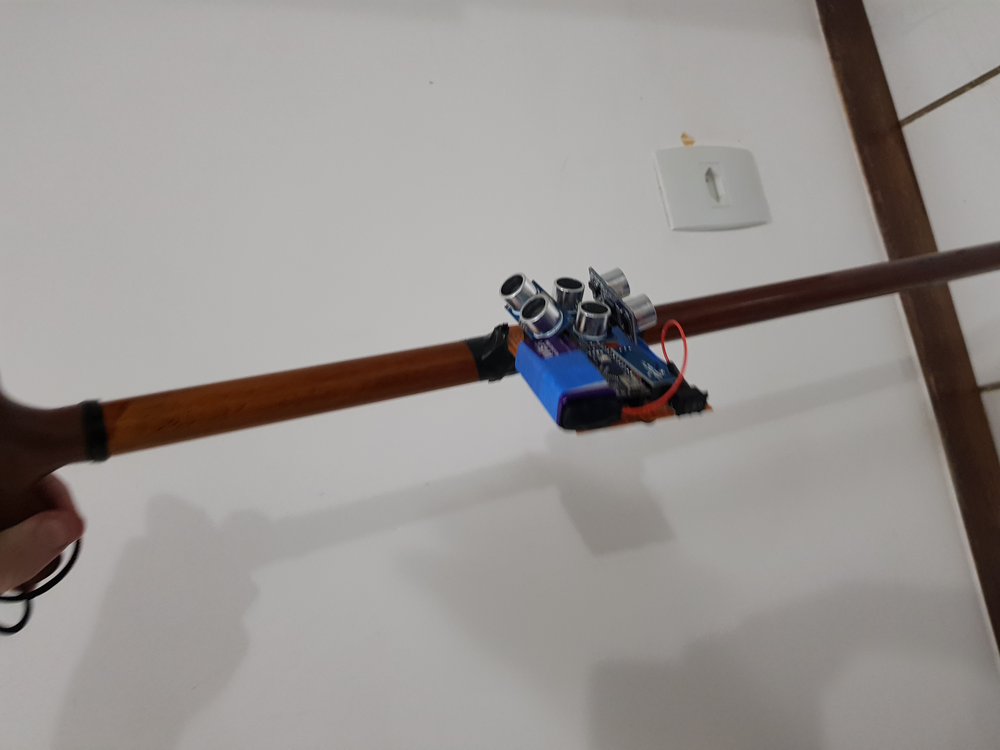

# smart-walking-cane
Smart cane for blinds with TRL 3. Made with arduino nano, 3 ultrasonic sensors and buzzer

## Steps

## Step 1 - Hardware Part

Copy the schematics at MODELAGEM_ARDUINO.png or MODELAGEM.fzz

## Step 2 - Code Part

Use the code at sensores.ino

## Future Projects

Can be done with nodemcu esp 8266 or 32 and turn it into a iot product.
